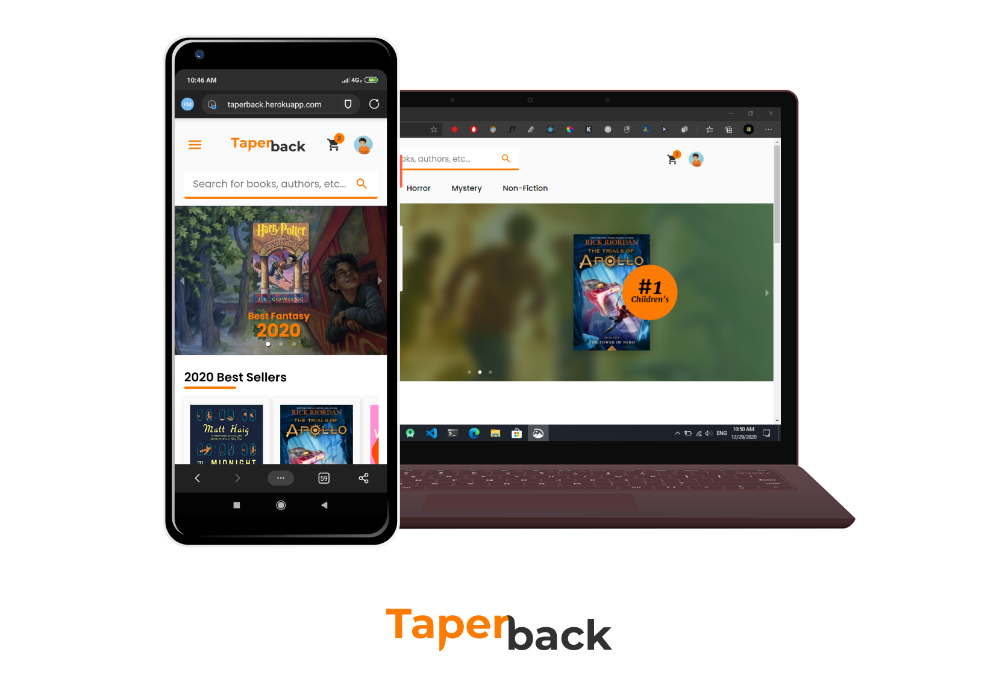

# Taperback - Ecommerce Website for Books
<br/>

A complete A-Z Ecommerce Website for Books.<br/> 
View Demo : [https://taperback.herokuapp.com/](https://taperback.herokuapp.com/) <br/>
<br/>


## ⚡ Current Features
* Search Books
* View Books
* Order Books
* Add to Cart
* Authentication using Google Auth

## 🚀 How to get started?
* To run Client (PORT 3000)
```
cd client
npm start
```
* To run Server (PORT 5000)
```
npm run dev
```

## ⚙ Environment Variables
* MONGO_SECRET (For Mongo Atlas)
* REACT_APP_CLIENT_ID (For Google Auth)

## Database Structure
    Check schemas folder